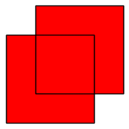
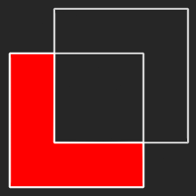
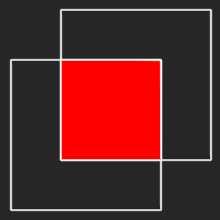
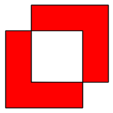

# RSClipperWrapper

`RSClipperWrapper` is a small and simple wrapper for [Clipper](http://www.angusj.com/delphi/clipper.php) - an open source freeware library for clipping polygons - by Angus Johnson implemented in **Swift 2.0**. The original *Clipper* sources of version 6.1.2 are distributed. *Clipper* is fast, has no errors even on complex polygons (inclusive holes) and comes with the [Boost Software License](http://www.boost.org/LICENSE_1_0.txt) and thus is free for both open source and commerical applications.

`RSClipperWrapper` contains two classes `Polygon` and `Clipper` for building polygons and to perform polygon clipping - **union**, **difference**, **intersection** & **exclusive-or**.






## Example

1. Construct `Polygon` classes: `let polygon1: Polygon = [CGPoint(x: 0, y: 0), CGPoint(x: 10, y: 10), CGPoint(x: 20, 0)]`
2. Use on of the static functions of the `Clipper` class to perform a polygon clipping, e.g.: `Clipper.intersectPolygon(polygon1, withPolygon: polygon2)`
3. That's it!

`RSClipperWrapper` contains an example project where you can play around with the four different ways of clipping polygons.

## Installation

`RSClipperWrapper` is not yet released on CocoaPod. Instead use

```
use_frameworks!

pod 'RSClipperWrapper', :git => 'https://github.com/rusty1s/RSClipperWrapper.git'
```

in your Podfile and run `pod install`.

## Documentation

## Additional information

`RSClipperWrapper` was developed and implemented for the use in *Dig Deeper - the Mining / Crafting / Trading game*. *Dig Depper* is currently in developement and has its own *GitHub* project [here](../../../DigDeeper).


## License

Copyright (c) 2015 Matthias Fey <matthias.fey@tu-dortmund.de>

Permission is hereby granted, free of charge, to any person obtaining a copy of this software and associated documentation files (the "Software"), to deal in the Software without restriction, including without limitation the rights to use, copy, modify, merge, publish, distribute, sublicense, and/or sell copies of the Software, and to permit persons to whom the Software is furnished to do so, subject to the following conditions:

The above copyright notice and this permission notice shall be included in all copies or substantial portions of the Software.

THE SOFTWARE IS PROVIDED "AS IS", WITHOUT WARRANTY OF ANY KIND, EXPRESS OR IMPLIED, INCLUDING BUT NOT LIMITED TO THE WARRANTIES OF MERCHANTABILITY, FITNESS FOR A PARTICULAR PURPOSE AND NONINFRINGEMENT. IN NO EVENT SHALL THE AUTHORS OR COPYRIGHT HOLDERS BE LIABLE FOR ANY CLAIM, DAMAGES OR OTHER LIABILITY, WHETHER IN AN ACTION OF CONTRACT, TORT OR OTHERWISE, ARISING FROM, OUT OF OR IN CONNECTION WITH THE SOFTWARE OR THE USE OR OTHER DEALINGS IN THE SOFTWARE.